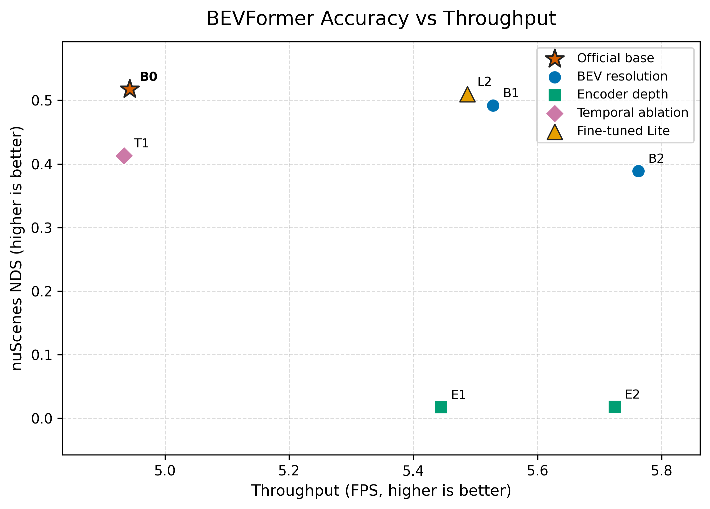
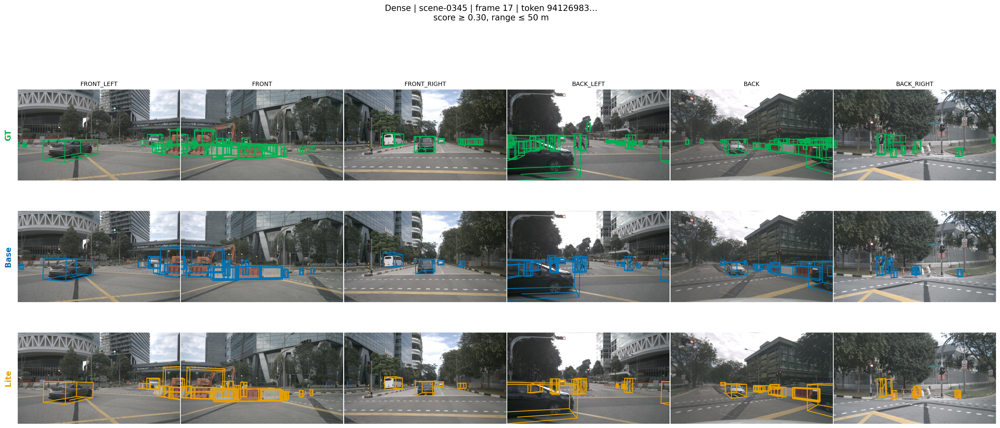

# BEVFormer 多视角 3D 感知轻量化与时序分析

本项目基于 [BEVFormer](https://github.com/fundamentalvision/BEVFormer)，研究
BEV 分辨率、Transformer Encoder 深度和历史 BEV 对多摄像头 3D 检测精度与
推理效率的影响。实验使用 nuScenes v1.0-trainval，并在统一硬件和测试协议下完成
全量评测与性能分析。

## 主要结果

| 模型 | NDS | mAP | 参数量 | 延迟 | FPS |
| --- | ---: | ---: | ---: | ---: | ---: |
| Base，BEV-200 | 51.73 | 41.63 | 69.03 M | 202.30 ms | 4.943 |
| BEV-150，zero-shot | 49.17 | 38.85 | 64.54 M | 180.89 ms | 5.528 |
| **BEV-150，2 epoch 微调** | **50.97** | **40.74** | **64.54 M** | **182.24 ms** | **5.487** |
| BEV-100，zero-shot | 38.87 | 26.08 | 61.33 M | 173.54 ms | 5.762 |
| Temporal OFF | 41.28 | 34.61 | 69.03 M | 202.66 ms | 4.934 |

最终选择 BEV-150 作为轻量化配置。与 Base 相比，它将 BEV query 数从 40,000
降至 22,500，参数量减少 6.51%，平均延迟降低 9.91%，FPS 提升 11.00%；经过
两轮低学习率适配后，NDS 和 mAP 分别只下降 0.77 和 0.89 个点。



## 实验结论

- 降低 BEV 分辨率可以获得稳定的速度收益，但 BEV-100 的精度损失明显，BEV-150
  是更合理的折中点。
- 未经训练直接将 Encoder 从 6 层截断到 4/3 层会使 mAP 降至 0，说明网络深度
  裁剪必须配合独立训练或微调。
- 关闭历史 BEV 后 NDS 从 51.73 降至 41.28，mAVE 从 0.3938 恶化到 0.8918；
  由于 Temporal Self-Attention 仍在执行，吞吐量没有提升。
- BEV-150 两轮微调恢复了 zero-shot 配置约 70.1% 的 NDS 损失和 67.9% 的
  mAP 损失。

完整实验表、指标定义和测试协议见
[docs/experiments.md](docs/experiments.md)。

## 可视化

场景按照 GT 元数据选择，不使用预测结果挑选样例。图中三行依次为 GT、Base 和
BEV-150，所有模型使用相同 token、置信度阈值和检测范围。



其余转弯、遮挡和远距离场景位于
[`docs/assets/visualizations`](docs/assets/visualizations)。

## 测试协议

- 数据集：nuScenes v1.0-trainval，验证集 6,019 帧
- 输入：六摄像头，1600×900
- 硬件：NVIDIA GeForce RTX 5090，FP32，batch size 1
- 性能测试：10 次 warmup，100 次正式测量，每次推理前后执行 CUDA synchronize
- 延迟范围：数据 scatter、模型 forward 和检测后处理，不包含 DataLoader 解码

本机验证环境为 Python 3.9、PyTorch 2.7.1+cu128、CUDA 12.8、MMCV-full 1.4.0、
MMDetection 2.14.0 和 MMDetection3D 0.17.1。

## 复现实验

按照上游项目说明安装依赖并准备 nuScenes 数据，然后下载官方
`bevformer_r101_dcn_24ep.pth` checkpoint。

```bash
export CUDA_HOME=/usr/local/cuda
export PYTHONPATH="$(pwd)/mmdetection3d:$(pwd):${PYTHONPATH:-}"

# Base 全量验证
python tools/test.py \
  projects/configs/bevformer/bevformer_base.py \
  ckpts/bevformer_r101_dcn_24ep.pth \
  --eval bbox

# 生成 BEV-150 插值 checkpoint
python tools/interpolate_bev_checkpoint.py \
  ckpts/bevformer_r101_dcn_24ep.pth \
  ckpts/ablation/bevformer_r101_dcn_24ep_bev150_interp.pth \
  --dst-size 150

# 两轮微调
python tools/train.py \
  projects/configs/bevformer_ablation/bev150_finetune.py \
  --work-dir work_dirs/bev150_finetune_2ep \
  --gpus 1 --seed 0 --no-validate

# 统一性能测试
python tools/profile_bevformer.py \
  projects/configs/bevformer_ablation/bev150_finetune.py \
  work_dirs/bev150_finetune_2ep/epoch_2.pth \
  --warmup 10 --iters 100 --workers 2 \
  --output work_dirs/bev150_profile.json
```

核心实验文件：

- `projects/configs/bevformer_ablation/`：BEV 分辨率、Encoder 和 Temporal 配置
- `tools/interpolate_bev_checkpoint.py`：BEV 与位置编码权重插值
- `tools/profile_bevformer.py`：延迟、FPS、显存和参数量统计
- `tools/plot_experiment_tradeoffs.py`：Accuracy–Efficiency 曲线
- `tools/visualize_base_lite.py`：GT/Base/Lite 场景对比
- `experiments/summary.csv`：完整实验结果

## 项目边界

BEV-150 使用官方 Base 权重插值后进行 2 epoch 低学习率微调，不等同于完整
24 epoch 从头训练。Encoder early-exit 和 Temporal OFF 用于机制分析，不作为
训练后的部署模型。性能结果来自单张 RTX 5090 的 FP32 测试，不能直接外推到
车端硬件。

## 致谢与许可

代码基于 Fundamental Vision 的 BEVFormer 开源实现，原论文与模型版权归原作者
所有。本仓库沿用上游 Apache 2.0 License。

```bibtex
@inproceedings{li2022bevformer,
  title={BEVFormer: Learning Bird's-Eye-View Representation from Multi-Camera Images via Spatiotemporal Transformers},
  author={Li, Zhiqi and Wang, Wenhai and Li, Hongyang and Sima, Chonghao and Lu, Jifeng and Qiao, Yu},
  booktitle={European Conference on Computer Vision},
  year={2022}
}
```
