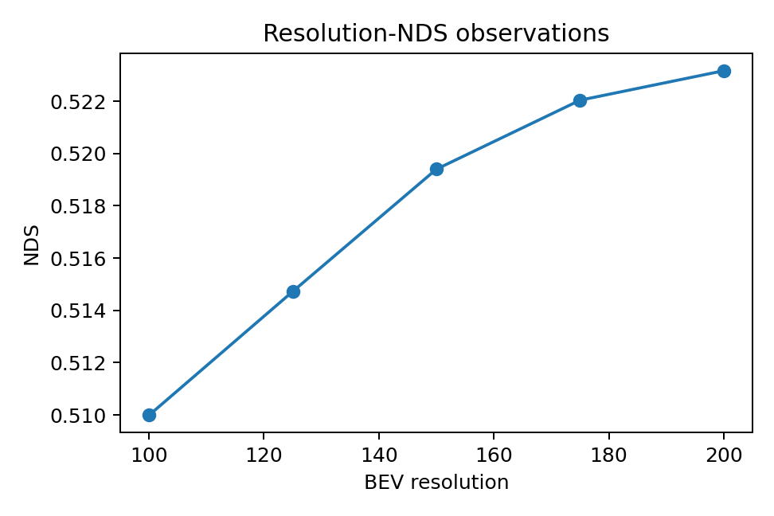
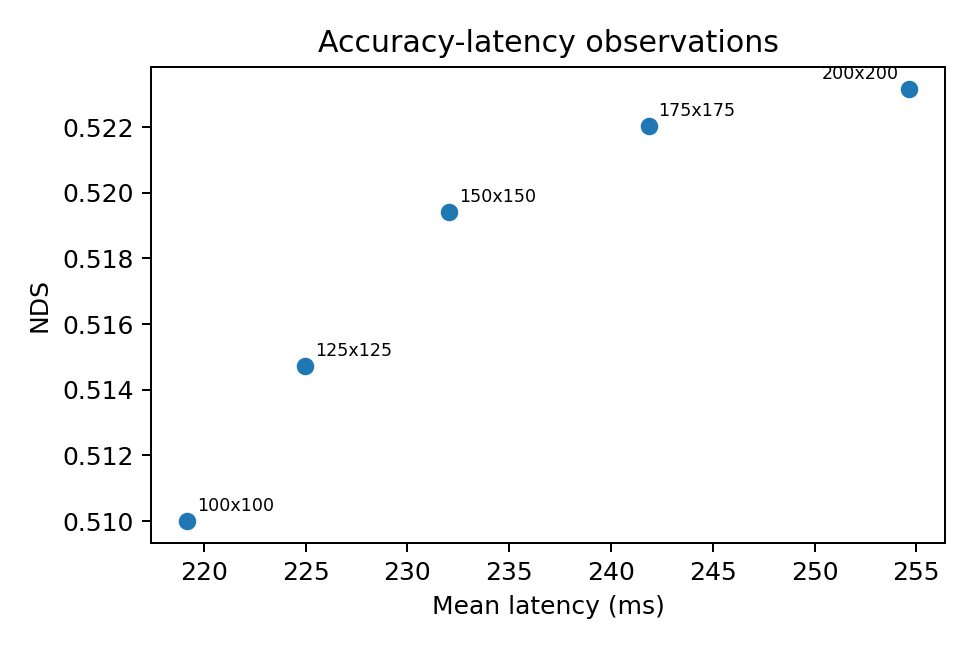

# RC-BEV：分辨率连续的 BEVFormer 多摄像头 3D 检测

本项目基于 [BEVFormer](https://github.com/fundamentalvision/BEVFormer)，研究如何让同一
个多摄像头 3D 检测模型在不同 BEV 网格分辨率下运行。RC-BEV 使用物理坐标驱动的
连续 Query 生成器替代固定网格查表，并在分辨率切换时迁移历史 BEV，使一个 checkpoint
能够在 100、125、150、175 和 200 五档网格上形成可调节的精度—延迟曲线。

当前仓库已完成一个随机种子（Seed 0）的 24 epoch 训练、五档分辨率完整 nuScenes
验证和统一硬件性能测试。多种子统计、未见分辨率和动态分辨率控制仍属于后续工作，
因此本文档只报告已经归档原始证据的结果。

## 方法概览

原始 BEVFormer-base 为 200×200 网格维护 40,000 个独立可学习 BEV Query。RC-BEV
改为对每个网格中心的真实物理坐标进行计算：

1. 在点云范围内生成 BEV 单元中心坐标 \((x,y)\)，并归一化到 \([-1,1]\)；
2. 使用 16 个二次幂频段构造正弦/余弦 Fourier 特征；
3. 通过两个轻量 MLP 分别生成 256 维 BEV Query 和位置编码；
4. 当相邻帧使用不同网格时，在物理坐标中重采样历史 BEV，再执行自车运动补偿和
   Temporal Self-Attention。

生成器没有随 \(H\) 或 \(W\) 增长的可训练参数。训练时，每个完整 batch 及其时序
队列从 100、125、150、175、200 中确定性选择一个网格，所有分辨率共享同一组
生成器参数。原始固定网格配置保持不变，只有 RC-BEV 配置显式启用连续路径。

实现与设计说明：

- [连续 Query 与历史 BEV 迁移](projects/mmdet3d_plugin/bevformer/modules/resolution_continuous.py)
- [Head 接入与运行时网格选择](projects/mmdet3d_plugin/bevformer/dense_heads/bevformer_head.py)
- [多分辨率训练配置](projects/configs/bevformer_rc/rc_bev_multires.py)
- [方法设计与代码数据流](docs/resolution_continuous_design.md)

## Seed 0 完整结果

训练使用 nuScenes v1.0-trainval、ResNet-101+DCNv2 初始化、两张 GPU、全局 batch
size 2，共 24 epoch / 337,560 iterations。下表精度均来自包含 6,019 帧的完整
nuScenes validation，性能均使用同一个 epoch-24 checkpoint。

| BEV 分辨率 | NDS | mAP | 平均延迟 (ms) | P50 (ms) | P95 (ms) | FPS |
| ---: | ---: | ---: | ---: | ---: | ---: | ---: |
| 100×100 | 0.5100 | 0.4069 | 219.18 | 219.16 | 219.59 | 4.563 |
| 125×125 | 0.5147 | 0.4129 | 224.95 | 224.90 | 225.49 | 4.445 |
| 150×150 | 0.5194 | 0.4152 | 232.03 | 232.01 | 232.31 | 4.310 |
| 175×175 | 0.5220 | 0.4164 | 241.85 | 241.83 | 242.15 | 4.135 |
| 200×200 | 0.5232 | 0.4172 | 254.63 | 254.60 | 255.04 | 3.927 |

相对同一 RC-BEV checkpoint 的 200×200 推理：

- 150×150 平均延迟降低 8.88%，FPS 提高 9.74%；
- 100×100 平均延迟降低 13.93%，FPS 提高 16.18%。

仓库此前复现的官方 Base-200 checkpoint 为 0.5173 NDS / 0.4163 mAP。RC-BEV
Seed 0 在 200×200 下为 0.5232 / 0.4172，但两者不属于多随机种子、匹配训练预算
的因果对照，因此不能据此声称连续 Query 必然提高精度。

## 性能测试协议

- 硬件：NVIDIA GeForce RTX 5090，物理 GPU1
- 精度与 batch：FP32，batch size 1
- 统计：20 次 warmup + 200 次正式测量
- 同步：计时边界前后均执行 CUDA synchronize
- 延迟范围：MMDataParallel scatter、模型 forward 和检测后处理
- 不包含：DataLoader、图像读取和解码

所有 P50、P95 和 FPS 都由逐次延迟样本计算。摘要 JSON、原始逐次样本和哈希位于
[Seed 0 evidence](experiments/rc_bev/evidence/seed0_epoch24/)。表格和图片由
[render_rc_bev_results.py](tools/render_rc_bev_results.py) 从
[results.json](experiments/rc_bev/results.json) 自动生成；未完成的实验不能填写结果值。

## 复现

依赖环境与上游 BEVFormer 一致。本机验证环境为 Python 3.9、PyTorch
2.7.1+cu128、CUDA 12.8、MMCV-full 1.4.0、MMDetection 2.14.0 和
MMDetection3D 0.17.1。准备 nuScenes 后，可使用统一入口执行测试和实验：

~~~bash
# 组件与配置契约测试
./run_rc_bev_experiments.sh cpu-test
./run_rc_bev_experiments.sh gpu-component-smoke

# 单卡多分辨率训练
SEED=0 ./run_rc_bev_experiments.sh train-multires

# 使用训练完成的连续 checkpoint
CHECKPOINT=/path/to/epoch_24.pth
./run_rc_bev_experiments.sh eval-seen "$CHECKPOINT"
./run_rc_bev_experiments.sh profile-seen "$CHECKPOINT"

# 尚未纳入当前结论的扩展实验
./run_rc_bev_experiments.sh eval-unseen "$CHECKPOINT"
./run_rc_bev_experiments.sh eval-dynamic "$CHECKPOINT"
./run_rc_bev_experiments.sh profile-seen-fp16 "$CHECKPOINT"

# 校验证据并重新生成 CSV、LaTeX 和图片
.venv5090py39/bin/python tools/render_rc_bev_results.py
~~~

训练用 epoch-24 checkpoint 为 746,878,834 bytes，超过普通 GitHub 文件限制，
因此不会提交到 Git。其 SHA256 为：

~~~text
741e6b937fadc5083ca833ee2b1ed4a3339bcf4714a967124704f0baa6a71e73
~~~

精确配置、checkpoint 大小与哈希记录在
[provenance.json](experiments/rc_bev/evidence/seed0_epoch24/provenance.json)。

## 与早期固定 BEV-150 实验的关系

仓库保留了早期固定分辨率研究：将官方 Base 权重中的 BEV Query 与行列位置编码插值到
150×150，再进行 6 epoch 低学习率适配。该实验验证了降低 BEV 分辨率的效率收益，
但每个网格仍依赖固定参数表。

RC-BEV 是后续的方法升级：它从物理坐标生成 Query/位置编码，并显式处理跨分辨率历史
BEV，因此一个训练完成的 checkpoint 可直接评估五档网格。两套实验的初始化、训练预算
和目标不同，结果不应混作同一组消融。

## 当前边界

- 当前完整方法结果只有 Seed 0，不能报告均值、标准差或置信区间；
- 140、160、180 未见分辨率与动态控制器尚未完成正式评测；
- FP16、MACs、能耗、TensorRT/车端硬件结果尚未完成；
- 匹配训练预算的 Base-200、固定 BEV-150、BEVFormer-S/Tiny 对照仍待补充；
- checkpoint 和完整 nuScenes 预测文件因体积限制只在本地保存，Git 中提供指标、
  profiling 样本和来源哈希。

## 致谢与许可

代码基于 Fundamental Vision 的
[BEVFormer](https://github.com/fundamentalvision/BEVFormer) 开源实现。本仓库沿用
上游 Apache 2.0 License；原论文、模型与上游代码版权归原作者所有。

~~~bibtex
@inproceedings{li2022bevformer,
  title={BEVFormer: Learning Bird's-Eye-View Representation from Multi-Camera Images via Spatiotemporal Transformers},
  author={Li, Zhiqi and Wang, Wenhai and Li, Hongyang and Sima, Chonghao and Lu, Jifeng and Qiao, Yu},
  booktitle={European Conference on Computer Vision},
  year={2022}
}
~~~
